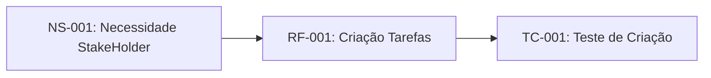

# Sistemas de Gestão de Tarefas

## 1. Instrodução

### 1.1 Próposito do Projeto 

Este documento especifica os requisitos funcioanis e não-funcionais para o Sistema de Gestão de Tarefas (SGT), seguindo o padrão IEEE 29148:2018.

### 1.2 Escopo

O SGT permitirá que usuários criem, organizem e acompanhem tarefas pessoais e profissionais com sisstema de prioridade prazos. 

### 1.3 Definção e Acrônimos

- **SGT**: Sistema de Gestão de Tarefas
- **RF**: requisito funcional
- **RNF**: requisito não-funcional
- **Sprint**: perído de 2 semanas de desenvolvimento

### 1.4 Referências 

- IEEE 28148:2018 - Systems and software engineering
- CMMI for Development. Version 2.0.

## 2. Descrição Geral

### 2.1 Perspectiva do Produto

O SGT será uma apicação web responsiva com sincronização em nuvens.

###2.2 Funções Principais

- Criação e edição de tarefas 
- Organização por progetos e tags
- Sistema de notificação
- RElatórios de produtividade

## 3. REquisitos especifícos

### 3.1 requisitos funcionais

#### RF-001: Criação de tarefas 

**Descrição**: O sistema deve permitir que usuários criem tarefas com títulos, descrição, data de vencimento e prioridade.
**Prioridade**: Alta.
**Versão**: 1.0 
**Data**: 2026-03-27
**Rastreabilidade**: derivado da necessidade do stakeholder NS-001

**Critérios de aceitação**:
- [ ] Formulário com campos obrigatório (Titulo) e opcionais
- [ ] validação de data (não permitir datas passadas)
- [ ] niveis de prioridade: baixa, média, alta
- [ ] confirmação visual após criação

**depndências**: nenhuma

---

### RF-002: organização por projetos 

**Descrição**: O sistema deve permitir agrupar tarefas em projetos personalizados
**Prioridade**: média
**Versão**: 1.0 
**Data**: 2026-03-27
**Rastreabilidade**: derivado da necessidade do stakeholder NS-001

**Critérios de aceitação**:

- [ ] usuários pode criar, renomear e excluir projetos
- [ ] tarefas podem ser atribuidas um ou nenhum projeto
- [ ] visualização filtrada por projeto

**depndências**: RF-001

---

### RF-003: Alterar a tarefa para concluido

**Descrição**: O sistema deve permitir alterar a tarefa para concluida
**Prioridade**: média
**Versão**: 1.0 
**Data**: 2026-04-10
**Rastreabilidade**: derivado da necessidade do stakeholder NS-001

**Critérios de aceitação**:

- [ ] usuários pode alterar a tarfea para comcluida
- [ ] tarefas podem retornar para não concluidas
- [ ] visualização filtrada por status (concluidas e não-concluidas)

**depndências**: RF-001

---

### 3.2 Reqistos não-funcionais

### RNF-001: desempnho

**descrição**: O sistema deve carregar a lista de tarefas em menos de 1 segundo  para até 100 tarefas.
**categoria**: desempenho.
**prioridade**: Alta.
**Versão**: 1.0
**Medição**: Tempo de resposta < 1s para 95% das requisições.

---

#### RNF-002: segurança

**descrição**: O sistema deve implementar autenticação OAth 2.0 e criptografia TLS 1.3.
**categoria**: segurança.
**prioridade**: crítica.
**conformidade**: LGPD(Lei Geral de proteção de Dados), ECADigital

---

## 4. Controle de VErsões 

### 4.1 Histórico de Alterações

| VErsão | Data | Autor | Modificação |
|--------|------|-------|-------------|
| 1.0    | 2026-03-27 | Equipe de Analise | Versão inicial de documento |
| 1.1    | 2026-04-10 | Equipe de desenvolvimento | inclusão da RF-003 |

### 4.2 rastreabilidade

Ingráfico de rastreabilidade do Requisito

### 5.  Aprovação

matriz de Aprovação 

| Alteração | Data | Autor | Aprovador |
| -   | - | - | - | 
| 1.0  | 2026-03-27 | Equipe de Análise | Stakeholder | 
| 1.1  | 2026-04-10 | Equipe de Desenvolvimento | Equipe de Análise |

.